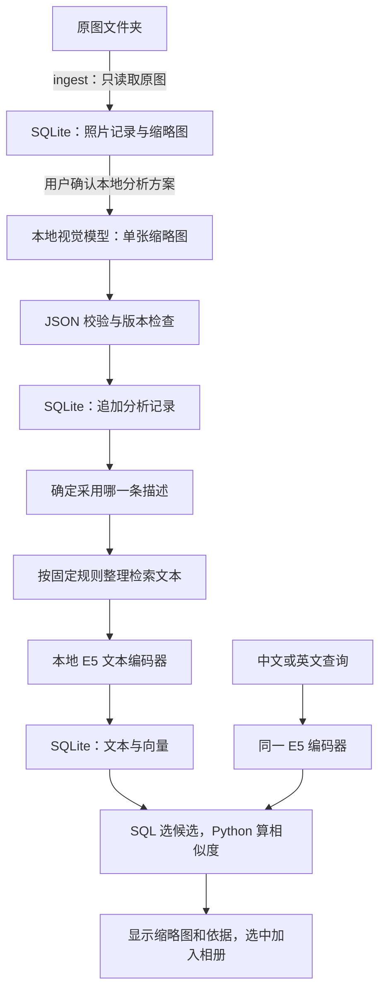

# Smart Albums：本地视觉分析与向量检索实施计划

设计日期：2026-09-06。状态：**供审阅的设计，尚未实施**。

这份计划结合了当前源码、正式 SQLite 的只读统计、本机硬件，以及模型和运行时的官方资料。本次没有下载视觉模型、运行照片分析、重建向量或修改正式数据库。示例记录是人为编写的数据合同示例，不是模型对真实照片的新分析结果。

## 1. 建议采用的整体方案

在现有 Smart Albums 中增加一个本地视觉分析入口：**先用 Qwen3.5-2B 做本机试验，以 Qwen3.5-4B 做质量对照；一个模型一次观察一张缩略图，生成完整的结构化描述；描述存入 SQLite，再用现有 multilingual-e5-small 生成中英文通用的搜索向量。**

第一版不需要为主体、构图、颜色、光线各安装一个大模型。这些信息可以由同一次视觉推理输出。尺寸、EXIF 和像素统计由普通代码读取或计算，避免让模型猜测可以直接获得的数据。

模型权重是可以重新安装的运行依赖，放在本机模型缓存中。**SQLite 保存照片信息、缩略图、模型版本清单、分析结果、采用的描述来源、检索文本、向量和任务记录。** 这样备份图库时可以带走用户数据，恢复计算能力时再按清单安装模型。

第一版继续保留已有 OpenAI、Codex 分析方式。选择本地方式时只使用本机运行时；选择云端方式时沿用现有确认流程。搜索继续作为独立功能，不需要先聚类。



图中的每一步都有独立状态。导入不会自动分析；保存分析不会在未包含相关授权时自动建立索引；搜索只编码当前查询，不补跑缺失的照片分析。如果用户已经确认“分析并建立本地索引”，则一次完成这两个步骤，不重复询问。

## 2. 现有实现和本次增加的内容

本次只读核对的正式数据库为 schema v5：129 张照片、129 个缩略图 BLOB、3 条分析、3 条向量、1 个相册。其余 126 张不能因为接入了新模型就被视为已经可搜索。

| 部分 | 当前事实 | 计划中的变化 |
| --- | --- | --- |
| 照片和相册 | 一个数据库，多对多相册关系，原图保存绝对路径 | 沿用；同一照片加入多个相册不复制分析或向量 |
| 缩略图 | SQLite BLOB，当前生成配置最长边 1024 像素、JPEG 质量 85 | 首轮直接使用已保存预览；不重新生成全部缩略图 |
| 视觉分析 | OpenAI 和 Codex 两种适配方式 | 增加明确的 `ollama-local` 适配器 |
| 结果格式 | 严格的 `photo-analysis-v1` | 第一阶段沿用；额外量化维度在后续 v2 中扩展 |
| 分析历史 | 同一照片可以有多条分析 | 保留，并显式记录当前采用哪条 |
| 采用结果 | 默认选有效记录中最新的一条 | 改为明确选择，避免本地试验自动改变搜索依据 |
| 文本向量 | E5 small、多语言、384 维、ONNX int8 | 继续使用；增加有 token 预算的文本整理规则 |
| 搜索 | SQL 取候选，Python 精确余弦排序 | 沿用；补充采用来源与索引版本的说明 |
| 分析输入检查 | 即使用缩略图，也先检查原图是否在线 | 新增“已入库预览”输入范围，支持针对保存版本离线分析 |
| 确认、失败恢复 | 已有方案、请求记录、缓存和恢复机制 | 接入本地运行时，保留现有入口 |

最重要的两项兼容性工作是：**本地分析不能自动取代已有云端分析；本地模型换了，也不代表已有 E5 向量必须全部重算。** 是否更新向量取决于最终采用的检索文本及编码配置。

## 3. 从哪些维度分析照片

第一阶段使用现有 v1 字段，把观察写得短、具体、有依据。下表描述的是我们要求模型尝试完成的任务，不是已经证明其在该图库上的准确率。

| 维度 | 主要回答什么 | 数据示例 | 由谁产生 | 进入文本 embedding |
| --- | --- | --- | --- | --- |
| 主体与可见行为 | 画面中有什么，主体在做什么 | 树木、行人、行走、船只 | 同一个本地视觉模型；`subjects`、描述 | 是 |
| 场景和环境 | 室内外、街道、森林、海边，前后景环境 | 河岸街道，背景有建筑 | 同一模型；`scene` | 是 |
| 空间关系和构图 | 主体位置、前中后景、引导线、留白、对称、视角 | 树干居中，枝条向两侧展开 | 同一模型；`composition` | 是 |
| 色彩与影调 | 黑白/彩色、主要色系、饱和感、明暗对比 | 黑白，灰色背景，暗色轮廓 | 同一模型；`color` | 是 |
| 光线 | 可见光照方向、软硬、逆光轮廓、阴影 | 光线柔和，背景较亮 | 同一模型；`lighting` | 是 |
| 摄影氛围 | 画面给人的视觉感受 | 安静、疏离、繁忙 | 同一模型；`mood` | 是，但控制篇幅 |
| 综合描述 | 用一小段话保留核心内容和各维度之间的联系 | 黑白树木照片，枝条交错，背景简洁 | 同一模型；`visual_description` | 是 |
| 搜索标签 | 有价值的简短检索词，避免重复堆砌 | 黑白、树木、枝条、留白 | 同一模型；`tags` | 是，去重 |
| 预览层面的技术观察 | 预览中可见的模糊、亮暗细节等及判断边界 | 暗部细节较少；无法判断原图噪点 | 同一模型；`technical_observations` | 初版不进入 |
| 文件和拍摄元数据 | 尺寸、格式、拍摄日期、曝光等真实记录 | 6000×4000、EXIF 中的快门信息 | ingest / EXIF 读取代码 | 优先用于精确筛选 |
| 可复现的像素统计 | 色彩分布、亮度分位数、极亮/极暗像素比例 | 灰度直方图、色板 RGB 和比例 | 后续 Pillow/NumPy 模块 | 数值用于筛选，不原样塞入文本 |

字段规则：主体、构图、色彩、光线、氛围每项通常 1–4 个简短条目；综合描述先以 2–4 句话为目标。字符数只是提示约束，最终是否适合 embedding 由实际 tokenizer 检查。

观察不能确定时，允许空数组；`scene` 可以为空字符串。没有发现技术问题不等于照片完美。氛围描述属于摄影感受，不据此推断人物内心。地点、人物身份、拍摄参数必须有可靠来源；仅凭画面不编造具体地名、人物名字或 EXIF。

不把“模型自报 0.93 置信度”当作校准过的概率，也不在第一版生成作品优劣总分、自动删图建议或美学排名。构图词汇只应在画面有证据时使用，不能每张照片都输出“三分法、电影感”。

## 4. 模型与本机运行方案

### 4.1 根据这台电脑选型

本次只读查询得到：Intel i5-1135G7、4 核 8 线程、15.8 GiB 内存、Intel Iris Xe 集成显卡及 DisplayLink 显示设备。没有枚举到 NVIDIA 独立显卡。**设计以 CPU 可以运行为基线，集显加速留待单独验证。**

| 角色 | 模型与本地标签 | 当前官方分发的量化与下载大小 | 本项目的选择理由 |
| --- | --- | --- | --- |
| 首轮运行和质量验证 | Qwen3.5-2B，`qwen3.5:2b` | Q8_0，约 2.7 GB，页面列总参数 2.27B | 先检验小模型的速度、中文表达和格式稳定性 |
| 同样照片的质量对照 | Qwen3.5-4B，`qwen3.5:4b` | Q4_K_M，约 3.4 GB，总参数 4.66B | 若小模型遗漏关系或构图，检验更大模型是否带来实际收益 |
| 后续较强设备候选 | Qwen3.5-9B，`qwen3.5:9b` | Q4_K_M，约 6.6 GB，总参数 9.65B | 不作为这台电脑的默认安装或必测项 |

这些分发信息核实自官方模型页面：[2B](https://ollama.com/library/qwen3.5:2b)、[4B](https://ollama.com/library/qwen3.5:4b)、[9B](https://ollama.com/library/qwen3.5:9b)。模型名称中的 2B/4B/9B 不是精确的总参数值。上游模型是支持图像与文本的模型，原始权重提供 Safetensors，采用 Apache-2.0 许可证；参见 [Qwen 官方模型卡](https://huggingface.co/Qwen/Qwen3.5-2B)。

**下载大小不等于运行内存。** 还要考虑视觉处理、上下文缓存、推理缓冲区、运行时、操作系统和其他应用。因此本轮不承诺“16 GB 一定流畅”，也不凭参数量推算每张需要多少秒。2B 的首选地位是待验证的工程选择；4B 如果质量明显更好且资源可接受，可以成为最终默认值。

建议首轮运行保护目标：串行执行；启动前查看实际可用内存；整个系统尽量保留至少约 3 GiB 可用空间，若持续换页、运行时内存错误或明显拖慢桌面则暂停。这是可调整的项目体验目标，不是模型官方最低配置。只报告实测峰值，不把模型文件大小填成内存使用量。

### 4.2 运行时和请求方式

建议先实现 **Ollama 的原生本地 `/api/chat` 接口**。它支持 Windows，本地 HTTP 只是主程序与本机推理进程通信，不代表照片上传到远程服务。[Windows 文档](https://docs.ollama.com/windows)

将 [Ollama v0.33.3](https://github.com/ollama/ollama/releases/tag/v0.33.3) 作为第一轮待验版本基线，记录实际二进制版本和校验和。暂时不并行实现 Ollama、llama.cpp、Transformers 三套后端；如果选定组合在实测中不稳定，再评估替代运行时。

设计参数如下，全部需要用小样本确认：

| 参数 | 初始值 | 原因 |
| --- | --- | --- |
| provider | `ollama-local` | 和云端 OpenAI、Codex 登录明确区分 |
| 地址 | `http://127.0.0.1:11434` | 只允许本机回环地址，不跟随外部重定向 |
| 每个请求的照片数 | 1 | 每张结果独立、易于校验和恢复 |
| 并发 | 1 | 避免本机内存和 CPU 相互争用 |
| thinking | 顶层 `think: false` | 摄影观察优先短输出；验证关闭确实生效 |
| 结构化格式 | 完整 `photo-analysis-v1` JSON Schema 对象 | 继续使用已有严格校验器 |
| temperature | 0，作为首验值 | 减少格式和措辞波动；不保证跨运行时完全复现 |
| 上下文 | 首验 8192 tokens | 应以图像处理后的实际占用验证是否足够 |
| 输出上限 | 首验 1600 tokens | 控制时间，截断则标记失败，不能保存半段 JSON |
| 图片输入 | SQLite 内保存的 JPEG 预览 | 不读取原图、不给模型磁盘文件路径 |
| 流式传输 | 首版 `stream: false` | 完整取得结果再校验，界面另显示任务进度 |

`think` 必须放在请求顶层；`format` 传真实 Schema 对象；REST 请求中的 `images` 是预览字节的 Base64，不能照搬某些 SDK 的文件路径示例。响应提取 `message.content` 后再解析 JSON，不能把整段响应元数据作为照片分析。[Chat API](https://docs.ollama.com/api/chat)、[结构化视觉输出](https://docs.ollama.com/capabilities/structured-outputs)

执行前必须验证 **指定版本 + 指定模型 + 图像输入 + 关闭 thinking + JSON Schema** 这个完整组合。历史版本出现过关闭 thinking 后格式约束未生效的问题，官方已经有[合并的修复](https://github.com/ollama/ollama/pull/15901)；这说明需要组合验收，不能只做纯文字 JSON 测试。

### 4.3 模型安装和日常使用分开

首次安装是一个独立动作，展示模型、大小、保存位置和许可证，下载后校验并登记。日常分析只检查本地运行时和已经登记的模型，不自动拉取模型。未安装或版本不符时返回可定位错误。

配置本地模式时关闭 Ollama 云端功能，例如运行时支持的 `OLLAMA_NO_CLOUD=1`，并验证生效；分析适配器不接受云端模型标签、不设置远程备用模型。默认回环地址和关闭云端的方法见 [Ollama FAQ](https://docs.ollama.com/faq)。这项设置应作用于明确配置的本地运行方式，不能无提示地改动用户其他服务的全局设置。

登记时从运行时读取完整模型 digest、实际量化、大小和格式。标签和专用别名可能改变，不能只记录 `qwen3.5:2b` 就认为版本固定。执行前核对实际 digest；模型更新需形成新的分析配置。官方 [模型清单 API](https://docs.ollama.com/api/tags) 提供上述识别字段。

## 5. 什么数据以什么形式存入 SQLite

### 5.1 存储分工

| 数据 | 存放位置 | 形式 | 备份时的作用 |
| --- | --- | --- | --- |
| 原始照片 | 用户原目录 | 数据库保留绝对路径、版本和已有元数据 | SQLite 备份不包含原图，原图仍需单独备份 |
| 缩略图 | `thumbnails` | JPEG BLOB + 尺寸、哈希、版本 | 可以离线显示已入库画面 |
| 视觉模型权重 | Ollama 模型缓存，或专门配置的本地模型目录 | 运行时管理的模型文件/manifest | 可以按清单重新安装，不把数 GB 权重塞进每个图库 |
| 视觉模型身份 | 新表 `model_artifacts` | 清单 JSON，包含版本、量化、内容摘要 | 能解释某条历史结果由哪套权重产生 |
| 分析结果 | 现有 `analyses` | 每次成功分析新增一条，结果放 `data_json` | 保留各模型的历史结果 |
| 当前采用的结果 | 新表 `photo_analysis_selections` | 照片 ID → 分析 ID | 搜索依据稳定且可切换 |
| 精简检索文本 | 新表 `embedding_documents` | 文本、来源、配方、token 数、裁剪记录 | 可以检查模型实际编码了什么 |
| 文本向量 | 现有 `photo_embeddings` | 384 维 float32 小端 BLOB | 不必每次搜索重新编码所有照片 |
| 编码器身份 | 现有 `embedding_encoders` | 编码模型及配方的配置 JSON | 避免不同版本的向量混在一起计算 |
| 任务状态和耗时 | 现有 plans / requests / runs | 请求级 JSON、状态、尝试记录 | 中断后恢复，核对实际执行次数 |

这保留了“一个 SQLite 管理多个相册”的原则。每张照片可以有多条历史分析，但不会因为加入不同相册而复制结果。

### 5.2 模型返回值与程序保存的记录分开

模型只返回下面 `data` 中的视觉观察。照片 ID、数据库 ID、模型哈希、版本、耗时、token 和错误状态都由程序填写，不要求模型生成。

```json
{
  "subjects": ["树木", "交错的枝条"],
  "scene": "室外，树木轮廓前方没有明显遮挡，背景较简洁。",
  "composition": ["树干位于画面中部", "枝条向两侧伸展形成线条关系"],
  "color": ["黑白影调", "暗色树木与浅灰背景形成对比"],
  "lighting": ["整体光线较柔和", "背景比树木轮廓明亮"],
  "mood": ["安静", "简洁"],
  "technical_observations": {
    "visible_issues": [],
    "assessment_scope": "preview",
    "limitations": ["仅观察缩放后的 JPEG 预览，无法据此判断原图的精细锐度和噪点。"]
  },
  "visual_description": "一幅黑白树木照片。暗色树干与交错枝条分布在浅灰背景前，画面主要依靠线条和明暗对比组织。",
  "tags": ["黑白", "树木", "枝条", "线条"]
}
```

这是兼容当前 v1 校验器的**虚构示例**。真实结果需要模型运行后保存，不能用这段内容替代任何照片的分析。

程序保存的完整记录继续使用现有 `analyses.data_json` 外层，新增本地来源和运行元数据。详见 [记录格式示例](local-vision-analysis-examples.json)。关键结构如下：

| 字段 | 示例类型 | 含义 |
| --- | --- | --- |
| `analysis_id` / `photo_id` | 字符串 ID | 关联照片和分析历史 |
| `content_version` | 内容版本字符串 | 这是哪一次已入库照片版本 |
| `input_image_hash` / `thumbnail_profile` | 哈希、配置字符串 | 对哪份已保存预览进行分析 |
| `analysis_config_id` / `cache_key` | SHA-256 指纹 | 分析配置身份及复用依据 |
| `analysis_profile` | JSON 对象 | provider、artifact ID、prompt/schema、输入处理、生成参数、运行时版本 |
| `data` | 上面的 JSON 对象 | 模型观察，不含运行指标 |
| `usage` | 对象或 `null` | 运行时真实返回的计数；未知不能填 0 |
| `execution_metrics` | JSON 对象 | 等待、加载、推理、校验、写库耗时，设备和峰值资源 |
| `created_at` | UTC 时间字符串 | 结果保存时间 |

稳定身份和安装位置要分开：模型清单按内容产生 artifact ID，本机缓存路径存在安装配置中。移动缓存目录不应导致所有照片重新分析。清单覆盖视觉相关权重、模板、处理器及 tokenizer 的内容；若运行时把这些打包进 manifest，则保留 manifest 内容摘要和完整模型 digest。

### 5.3 建议的增量数据库结构

从 schema v5 升到 v6，核心新增两张表；为了让检索文本可检查，再增加一张小表。保留现有主表列数和数据结构，降低迁移范围。SQL 草案保存在 [迁移结构示例](local-vision-schema-v6.sql)。

```sql
CREATE TABLE model_artifacts (
    artifact_id TEXT PRIMARY KEY,
    manifest_json TEXT NOT NULL CHECK(json_valid(manifest_json)),
    created_at TEXT NOT NULL
);

CREATE UNIQUE INDEX analyses_photo_analysis
ON analyses(photo_id, analysis_id);

CREATE TABLE photo_analysis_selections (
    photo_id TEXT PRIMARY KEY REFERENCES photos(photo_id),
    analysis_id TEXT NOT NULL,
    selected_at TEXT NOT NULL,
    selection_reason TEXT NOT NULL,
    FOREIGN KEY(photo_id, analysis_id)
        REFERENCES analyses(photo_id, analysis_id)
);

CREATE TABLE embedding_documents (
    document_id TEXT PRIMARY KEY,
    analysis_id TEXT NOT NULL REFERENCES analyses(analysis_id),
    encoder_id TEXT NOT NULL REFERENCES embedding_encoders(encoder_id),
    recipe_version TEXT NOT NULL,
    text_hash TEXT NOT NULL,
    retrieval_text TEXT NOT NULL,
    token_count INTEGER NOT NULL CHECK(token_count >= 0),
    trimming_json TEXT NOT NULL CHECK(json_valid(trimming_json)),
    created_at TEXT NOT NULL,
    UNIQUE(analysis_id, encoder_id, text_hash)
);
```

组合外键防止把照片 P1 错误指向照片 P2 的分析。`embedding_documents` 存不带 `passage: ` 的正文，`token_count` 记录包含前缀和特殊 token 后的实际输入长度；`text_hash` 仍按正文计算，前缀等由 encoder ID 固定。

JSON 以 UTF-8 文本保存，查询时可用 SQLite 的 `json_extract` / `json_each`；需要高频精确筛选时再增加索引或专用字段，不必第一版给每个观察维度建表。[SQLite JSON 官方说明](https://www.sqlite.org/json1.html)

旧向量可能没有 `embedding_documents` 行，迁移时仍允许读取；不能通过一次新增 LEFT JOIN 把旧结果全部排除。新向量和对应文本应在同一短事务中写入，按 `analysis_id + encoder_id + text_hash` 保持一致。

这段 DDL 不是完整迁移器：实施时仍需一致性备份、填充采用来源、异常回滚和最终版本标记。不要直接在正式数据库粘贴执行。

## 6. 一张照片多条分析时，怎样决定搜索用哪条

建议每张照片维护一个明确的“当前采用描述”，同时保留所有分析历史。例如：

| 分析记录 | 来源 | 作用 |
| --- | --- | --- |
| `analysis_old` | 已保存的 Codex 分析 | 当前采用，现有向量来自它 |
| `analysis_local_2b` | 新的本地 2B 分析 | 候选结果，可预览对照 |
| `analysis_local_4b` | 新的本地 4B 分析 | 另一个候选结果 |

执行计划增加 `adoption_policy`：

| 策略 | 行为 | 默认使用场景 |
| --- | --- | --- |
| `candidate_only` | 只追加历史，不更换采用来源 | 2B/4B 与已有结果对照 |
| `fill_missing` | 没有当前有效采用结果时才采用新成功结果 | 给未分析照片补齐描述 |
| `replace_selected` | 明确范围内用新结果替换当前来源 | 用户确认使用新模型结果 |

若执行时发现有人已经修改了采用来源，应检测选择版本变化并报告冲突，不能悄悄覆盖新的选择。失败、无效或输入已过期的结果不能成为当前来源。

“当前采用的描述有效”与“使用本次选定模型可以命中缓存”分别计算。例如旧 Codex 描述仍可用于搜索，但用户要求试验 Qwen 时仍需要一个本地请求。相册结果里同时显示这两种统计，不能笼统称为“已有分析所以不用调用”。

切换采用来源后，如果没有同时生成新向量，索引显示过期并排除该旧向量；不会继续用旧描述的向量却展示新描述。已有本地索引授权时，可以执行“采用并更新索引”组合动作。

## 7. 照片输入、缓存和离线行为

第一阶段分析对象固定为 `indexed_preview`：从 SQLite 读取已入库预览、验证 BLOB 完整性、内容版本和缩略图配置，然后把字节交给本地模型。

如果原图磁盘暂时断开，依然可以分析这份保存的预览；界面写清楚“针对已入库预览版本”。这不能证明磁盘上的原图目前未变化。再次 ingest 发现变化后，原分析仍留作历史，新版本需要自己的有效分析。

新增输入范围必须贯穿 `prepare`、方案快照、执行前检查和保存前检查，不能仅删除一次 `stat()`。同一请求处理期间照片版本变化，保存结果应标记过期，不替换当前来源。

暂时不改缩略图默认大小。若首轮 CPU 时间过长，可增加受控的 768 像素输入实验，与原 1024 预览作对照；必须记录实际输入字节哈希、派生尺寸、重采样规则和模型内部处理配置。派生输入与库内预览的哈希需要分开保存，不能把两者混用而破坏现有缓存检查。第一阶段先省去这项变化。

分析配置指纹至少包含：模型内容身份、量化、运行时版本/实际推理后端、prompt 内容哈希、schema 内容哈希、语言、输入处理规则、thinking 与采样配置。照片级缓存再加照片 ID、照片版本和输入预览哈希。不能用模型名称相同就判定缓存可用。

模型安装路径、队列等待时间、重试次数属于运行设置或记录，不应因为这些值变化就改变观察的内容身份。无法保证跨设备逐 bit 重现，固定这些配置的目的在于追溯和受控对照。

## 8. 分析之后如何生成 embedding

### 8.1 保留现有多语言文本模型

继续用 `intfloat/multilingual-e5-small`。当前项目已经固定了 ONNX int8 分发、文件哈希、运行依赖、384 维、注意力掩码均值池化和 L2 归一化，正常编码可以离线运行。

E5 的官方约定是查询加 `query: `、文档加 `passage: `，中文同样适用；最大输入为 512 tokens。模型支持多语言，输出维度为 384。[E5 官方模型卡](https://huggingface.co/intfloat/multilingual-e5-small/raw/main/README.md)

因此照片只需要一套中文描述和一套向量，中文、英文查询用同一编码器进入同一向量空间。暂时不额外生成英文描述，也不把每个维度都建成独立向量。跨语言效果仍需用实际查询验证。

### 8.2 新增有预算的检索文本配方

当前 `photo-text-v1` 把描述放在最前，再拼主体、场景、构图、色彩、光线、氛围和标签。描述过长时，512-token 右截断可能把后面的颜色和构图信息全部丢掉。

建议增加可选择的 `photo-text-v2`，保留完整原始分析 JSON，另外生成一个专门用于搜索的短文本。**先保证各维度有基础份额，再把剩余空间给核心内容。** 不调用另一个大模型来压缩文本。

初始预算建议如下，数值属于待测配方参数：

| 文本部分 | 初始内容 token 预算 |
| --- | ---: |
| 综合描述 | 110 |
| 主体与场景 | 90 |
| 构图及空间关系 | 55 |
| 色彩 | 40 |
| 光线 | 40 |
| 氛围和去重标签 | 45 |
| 预留给标签、前缀、特殊 token 和拼接误差 | 100 |
| 整段目标上限 | 480 |

每部分使用实际 E5 tokenizer 计数。分段 token 数不能简单相加就当整段准确长度：完成拼接后再把前缀和特殊 token 算进去，校验总长。优先保留完整条目和句子；若单条过长，按固定 token 边界缩短并记录。空字段的剩余份额可按固定优先级分配，结果必须可复现。

完整分析中的技术限制、模型名、运行时间、绝对路径、JSON 键名和未经验证的猜测不进入检索文本。暂不把大段 OCR 文本混入；如果以后需要按招牌文字精确查找，可增加独立文字检索能力。

示例检索正文：

```text
描述：黑白树木照片，枝条交错，浅灰背景较简洁。
主体：树木；枝条
场景：室外
构图：树干居中；枝条向两侧延展
色彩：黑白；暗色轮廓与浅灰背景
光线：柔和；背景较亮
氛围：安静
标签：线条
```

编码时实际输入为 `passage: ` 加上述正文。`embedding_documents` 保存正文、分析 ID、encoder ID、配方版本、正文哈希及裁剪详情，例如哪些字段被缩短、哪些空字段被省略。原始描述不因检索文本裁剪而丢失。

v2 正常输出目标是编码器的 `truncated=false`；配方的 `trimmed_fields` 可以非空，两者含义不同。前者表示编码器是否再次硬截断，后者表示我们是否为了预算主动缩短了原始文本。

### 8.3 向量的具体存储形式

现有 `photo_embeddings` 不需要因本地视觉模型而改结构。关键字段如下：

| 字段 | 内容 |
| --- | --- |
| `photo_id` | 对应照片 |
| `analysis_id` | 向量正文来源，必须匹配当前采用描述 |
| `encoder_id` | 模型、权重版本、配方、量化、前缀等的配置身份 |
| `text_hash` / `recipe_version` | 哪份检索文本、哪套整理规则 |
| `content_version` | 照片版本 |
| `dimensions` / `dtype` / `normalized` | `384` / `float32-le` / `1` |
| `vector` | 384 个 float32 小端数字组成的 BLOB |
| `vector_hash` | BLOB 校验和 |
| `token_count` / `truncated` | 实际编码长度和是否发生硬截断 |

每条向量的纯数值大小是 **384 × 4 = 1,536 字节**。129 张约 193.5 KiB；10,000 张约 14.65 MiB。这只是单套向量 BLOB 的大小，不含 SQLite 页、索引、文本、缩略图、分析历史，也不代表进程内 Python 对象占用。

改成 v2 配方会产生新的 encoder ID，因此可同时保留 v1 和 v2 向量。先增加显式选择编码配置的入口做对照，迁移完成后不自动切换现有搜索默认值。待选定新配方并完成目标范围索引，再明确切换默认配置，报告各版本覆盖率。配置切换必须持久化在 SQLite 的设置记录中；现有通用 ID/JSON 设置存储可复用，但搜索设置使用独立键，不能混入视觉调用配置。

同一 encoder 下目前每张照片只保存一条当前向量；切换采用分析再编码，会更新这条向量。其他 encoder 的向量仍可保留。这不等于已经有完整向量历史库。旧分析和其检索文本可以保留，必要时重新编码。

### 8.4 哪些变化需要重新计算

| 变化 | 视觉分析 | 文本 embedding |
| --- | --- | --- |
| 加入相册、移动相册关联、相册改名 | 不需要 | 不需要 |
| 本地模型生成候选结果但未采用 | 已产生候选，不再额外调用 | 当前搜索向量不变 |
| 采用另一条已保存的有效分析 | 不需要 | 更新该照片；初版按来源变化重算 |
| 仅更新文本配方 | 不需要 | 用已有描述重新编码 |
| 更换 E5 权重、量化、池化或前缀 | 不需要 | 新 encoder 下重建目标范围 |
| 视觉模型升级但没有要求重跑 | 不自动调用 | 已采用结果和向量继续可用 |
| 新照片或已入库内容版本改变 | 用户确认后生成有效新分析 | 采用新描述后生成 |
| 模型缓存目录迁移 | 不需要 | 不需要 |
| 搜索语句变化 | 不需要 | 只为本次查询生成向量 |

以后可以在正文哈希和 encoder ID 完全一致时复用向量数值并更新来源；第一版保持较简单的来源变更即重算策略，避免漏掉版本检查。

## 9. 搜索时 SQL 与 Python 分别做什么

查询示例：“找黑白、枝条比较密集的树木照片。”

先发现并确定实际相册 ID 和使用的 encoder ID。SQL 选出相册中有向量且来源与当前采用记录一致的候选：

```sql
SELECT p.photo_id, p.data_json AS photo_json,
       a.data_json AS analysis_json,
       e.analysis_id, e.content_version, e.encoder_id, e.recipe_version,
       e.text_hash, e.dimensions, e.dtype, e.normalized,
       e.vector, e.vector_hash
FROM album_photos AS ap
JOIN photos AS p ON p.photo_id = ap.photo_id
JOIN photo_analysis_selections AS s ON s.photo_id = p.photo_id
JOIN analyses AS a
  ON a.analysis_id = s.analysis_id AND a.photo_id = p.photo_id
JOIN photo_embeddings AS e
  ON e.photo_id = p.photo_id AND e.analysis_id = s.analysis_id
WHERE ap.album_id = :album_id
  AND e.encoder_id = :encoder_id;
```

这只是候选 SQL。程序仍需验证照片索引版本、缩略图元数据、分析输入版本、当前正文哈希及向量长度/哈希/归一化等。查询不能仅因 `analysis_id` 相同就认为向量有效。整个过程不需要原图在线。

接着本地编码 `query: 找黑白、枝条比较密集的树木照片`。对验证通过的候选逐个计算：

```python
# q 和 v 必须来自同一 encoder 配置，并已 L2 归一化。
score = sum(q_i * v_i for q_i, v_i in zip(q, v))
```

按分数降序、照片 ID 作稳定的同分排序，取前 K 张，再按这个排名读取缩略图。SQL 的 `WHERE photo_id IN (...)` 本身不保持排名，返回后要按排名列表重排。

例如要查看某个结果的模型描述，可以用：

```sql
SELECT a.analysis_id,
       json_extract(a.data_json, '$.analysis_profile.model') AS model,
       json_extract(a.data_json, '$.data.visual_description') AS description
FROM photo_analysis_selections AS s
JOIN analyses AS a ON a.analysis_id = s.analysis_id
WHERE s.photo_id = :photo_id;
```

当前规模继续使用精确遍历，不必立即加 SQLite 向量扩展。将来评估更大图库时，以查询耗时和内存实测决定是否引入向量索引。

相似度不是概率，也不是精确条件校验。“必须没有人”“恰好三棵树”等不能仅靠向量分数保证；必要时依据已确认的结构化字段作额外筛选，或明确提示需要人工核对。搜索结果仍使用已有快照机制，加入相册时采用用户选中的确切照片 ID。

## 10. 可选的第二阶段：量化分析和直接视觉向量

### 10.1 像素统计先采用普通算法

在本地观察链路稳定后，再增加 `photo-analysis-v2`：保留 v1 的核心检索字段，另设明确的扩展对象。不能把新字段直接塞进 v1 输出而继续调用旧严格校验器。

建议首先考虑颜色分布、亮度分位数及极亮/极暗像素比例。每项记录算法版本、输入范围、输入哈希、尺寸、颜色处理规则及数值单位。先固定 EXIF 方向、ICC/颜色空间处理、采样尺寸、阈值与归一化方式，再比较统计值。

例如一个将来的数据对象可以是：

```json
{
  "schema_version": "preview-metrics-v1",
  "source": "deterministic_pixels",
  "scope": "indexed_preview",
  "input_image_hash": "EXAMPLE_NOT_A_REAL_HASH",
  "algorithm_profile": "EXAMPLE_PENDING_IMPLEMENTATION",
  "luma_p05": null,
  "luma_p50": null,
  "luma_p95": null,
  "near_black_fraction": null,
  "near_white_fraction": null,
  "palette": []
}
```

这是格式意图，具体算法和阈值还需在该阶段固定。没有计算的数值为 `null`，不能编造例子中的“实测分数”。模型文字观察和算法数值分开存，避免让亮度比例直接变成曝光是否正确的结论。

缩略图上的锐度/纹理指标只适合在受控条件下辅助比较，不能据此判断原图对焦、噪点或最终印刷质量。若以后确实需要原图技术评估，应另建原图/裁剪输入方案，不自动读取和分析全部大图。

OCR、物体框、分割、面部识别、美学打分都不是本轮依赖。用户出现明确需求后，再分别做模型选型、输入分辨率和验收设计。

### 10.2 是否再做一套“图片直接生成”的 embedding

本计划必做的是**描述文本向量**。直接从图像提取向量是另一条路线，可用于描述遗漏的信息或以图找图，但不要求为了实现本地分析而立即加入。

后续候选可以评估 `google/siglip2-base-patch16-224`，其官方模型卡提供图文检索和图像特征提取方法。[Google 官方模型卡](https://huggingface.co/google/siglip2-base-patch16-224)

| 路线 | 查询向量 | 照片侧向量 |
| --- | --- | --- |
| 当前描述搜索 | E5 编码查询文字 | E5 编码照片描述 |
| 未来直接图文搜索 | SigLIP 2 同一检查点的文本编码器 | 同检查点的图像编码器 |
| 未来以图找图 | SigLIP 2 图像编码器 | 同配置的图像编码器 |

不能用 E5 查询向量直接匹配 SigLIP 图像向量，即使维数碰巧相同也不行。SigLIP 2 有多语言能力，但中文和英文摄影查询的效果仍需配对验证；多语言定位不能代替本项目测试。[SigLIP 2 论文](https://arxiv.org/html/2502.14786v1)

如果以后确实混合两条搜索路线，先分别产生排名，再研究排名融合，不默认把不同模型的原始余弦分数直接相加。每维度多向量也暂缓；只有实测证明主体信息经常压过构图、色彩、氛围，才考虑 `content` / `appearance` 两个槽位，并相应调整当前一照片一 encoder 一向量的主键设计。

## 11. 用户操作流程与执行记录

用户：“用本地模型分析相册 A，并让新描述可以搜索。”

1. 定位相册和照片，读取已采用描述与各模型缓存状态。
2. 检查已安装本地模型身份；缺少模型时展示独立安装步骤，准备方案不自动下载。
3. 展示本地方式、具体模型/量化、照片范围、输入为已入库预览、单图串行、采用策略、是否同时建立索引。
4. 将实际可复用、待分析、输入损坏和将影响的索引数量分别列出。已有其他模型描述不等于本次模型缓存命中。
5. 用户确认整个方案后执行，持久化逐张进度；同一模型在一批照片之间保持加载，减少重复启动。
6. 严格验证输出和输入版本，保存成功分析，按已确认策略采用；若包含建立索引，则更新相应照片的向量。
7. 汇总成功、缓存复用、失败、未完成、实际请求次数、耗时及当前搜索覆盖率。

例如，对正式库默认采用 `fill_missing` 时可以推荐处理 126 张待分析照片；如果是模型对照，则只选已有描述的 3 张并用 `candidate_only`。这两种方案都只是将来的操作示例，本次文档编写不授权运行它们。

本地执行没有云端 Batch 折扣或服务商 TPM 额度。本地的限制是 CPU、内存和运行时队列；仍使用持久化任务逐张执行，不把“串行处理一批照片”叫作 OpenAI Batch API。请求失败后是否重试由错误类型决定，不能反复重试内存不足或缺失模型。

建议保存这些时间，单位统一为秒：队列等待、模型加载、图像/提示处理、生成、校验、数据库写入、embedding 编码，以及端到端墙钟时间。Ollama 返回的时间字段以纳秒计，转为秒时保留原字段供核对；token 按运行时实际计数存储。[响应计数说明](https://docs.ollama.com/api/chat)

没有云端 API 请求费用不代表没有本机计算成本。模型报告的 token 不应套用之前 Codex 的单价或上下文计数；运行时未拆分图片 token 时保持未知。多次尝试的已知用量累加，未知尝试单独计数，不能记成 0。

格式失败最多安排一次有记录的修复尝试，或者直接失败供重跑；只允许语法/格式修复，不要求模型补造未知照片内容。每次尝试都计入时间和请求数。停止任务时保留已完成结果；若请求超时而运行时可能仍在处理，标记未确定，确认结束后再恢复，避免重复推理。

## 12. 分阶段实施与交付

| 阶段 | 修改范围 | 交付结果 | 完成条件 |
| --- | --- | --- | --- |
| P0：固定合同 | 本地配置、输入范围、采用策略、v1 输出、v2 文本预算、候选模型 | 接口草案与模型清单格式 | 所有示例能校验；明确未实施字段 |
| P1：数据库与来源选择 | v5→v6、三张新表、采用结果读取、索引状态 | 迁移器与一致性测试 | 129 张照片、3 条分析和3条向量保持原状且仍可使用 |
| P2：本地模型准备和适配 | 安装检查、manifest 登记、`ollama-local`、单图请求 | 可检查配置的本地适配器 | 用模拟响应验证路由、格式、错误与记录；本阶段不需要真实照片推理 |
| P3：接入确认和执行 | 方案快照、输入策略、串行执行、采用策略、恢复 | 可预览并确认的本地分析方案 | 未确认零推理；不会误发 `/responses` 或转向云端 |
| P4：检索文本和向量 | `photo-text-v2`、文本保存、显式 encoder 选择、增量失效 | 可检查输入文本的索引 | 已有描述可直接编码；不重新调用视觉模型 |
| P5：真实小样本验收 | 经确认后安装、单图冒烟、3张对照、代表性图库样本 | 模型对照和时间/内存/搜索报告 | 达到下节质量与兼容性关卡；决定2B还是4B |
| P6：文档与交付 | Skill、配置说明、结果预览、安装/恢复指南 | 用户可直接按自然语言使用 | 从干净环境重现设置、查看已存结果和继续任务 |

P1 完成后才能让新分析影响正式采用来源；P2–P3 的模拟验证不代表模型质量已经通过；P5 通过前不自动跑完 126 张。

建议实施顺序为 **先保住已有数据和来源选择，再接本地模型，最后做文本预算及质量验收**。无需同时更换视觉模型、embedding 模型、图像输入尺度和搜索算法；逐项对照才能知道改进来自哪里。

### 12.1 主要代码影响位置

| 现有或拟新增文件 | 计划修改 |
| --- | --- |
| `sqlite_storage.py` / `storage.py` | v6 迁移、新表访问、短事务和来源一致性 |
| `status.py` | 当前采用结果与本次模型缓存分别返回 |
| `analyze.py` | 按输入范围验证预览，不再对所有模式一律要求原图在线 |
| 新 `local_vision.py` | Ollama 请求、完整响应解析、版本检查、错误与指标映射 |
| 新 `model_artifacts.py` | 模型登记、固定身份与本机安装配置分离 |
| `analysis_settings.py` / `provider_capabilities.py` | 新 provider，模式能力和本地默认值 |
| `analysis_planner.py` | 输入范围、采用策略、索引动作进入方案与确认摘要 |
| `analysis_execution.py` | 本地调用分支、采用策略、保存前复核和恢复 |
| `embedding_text.py` / `embedding_model.py` | 保留v1，新增v2配方选择及实际 token 预算 |
| `embeddings.py` / `search.py` | 显式采用来源、文本快照、encoder选择、覆盖与过期状态 |
| `workflow_cli.py` / 报告模块 | 本地安装检查、方案、候选/采用对照、计时及索引信息 |
| `SKILL.md` / references | 自然语言使用方式、明确安装/分析/索引的触发边界 |

当前 provider 枚举只有 OpenAI/Codex，且即时执行对非 Codex 请求仍有 OpenAI 专用路径。实施时不能只加一个枚举或更改 URL，必须改调用分派，避免本地方案最后仍走云端 Responses。

## 13. 测试、评估与验收标准

### 13.1 数据和流程测试

| 测试 | 应当证明的行为 |
| --- | --- |
| 旧库迁移 | 数据库备份有效，原表逐行内容不变，采用来源与原先有效结果一致 |
| 迁移中途失败 | 事务回滚，旧程序配合旧库备份仍能恢复；不留下半迁移状态 |
| 跨照片分析选择 | P1 不能采用 P2 的分析，组合外键拒绝 |
| 候选模式 | 新分析保存成功，但当前描述和搜索结果不变 |
| 采用策略 | 首次采用、明确替换、并发选择冲突都按方案处理 |
| 输入过期 | 执行前后内容/预览变化不会被保存为当前有效分析 |
| 离线预览 | 原图不在线且预览有效时可以分析已入库版本；损坏BLOB明确失败 |
| 本地路由 | 未确认、查询状态、浏览、搜索不会触发视觉推理；本地模式没有外部请求 |
| 格式失败 | 缺字段、多字段、空描述、截断JSON不会污染当前结果 |
| 恢复 | 成功照片不会重复执行；失败和未确定请求能定位 |
| 长描述 | 色彩/光线/构图不会全部被开头描述挤掉，裁剪信息可查 |
| 向量一致性 | 来源切换失效、不同模型/配方隔离，长度与归一化检查通过 |
| 重复索引 | 内容、来源和配置未变化时新增文档编码次数为零 |
| 相册关系 | 增删相册成员不复制或重算分析/向量 |

### 13.2 本机兼容性与摄影质量

未来经用户确认后，先用一张非敏感测试图验证可执行性，再用现有3张已有描述的照片做一致输入对照。旧云端描述只是参考，不是真值；最终依据仍是照片可见内容及人工标注。

通过后选约20–30张具有代表性的照片，涵盖黑白、彩色、森林、街景、人像/人物、低光、逆光、极简、复杂背景、横竖幅。每张人工记录核心主体、场景和可见构图/光色事实；评价观察是否有依据，不能要求模型措辞与参考文本逐字相同。

建议的初始关卡（待小样本校准，不是已经达到的结果）：

- 所有成功保存记录均通过严格 schema；未经修复的一次通过率目标至少95%，同时公开修复和失败的数量。
- 人工核对的核心主体/场景事实目标至少90%正确；遗漏和编造分别计数，并给出样本分母。
- 构图、色彩、光线按“有依据 / 不确定 / 错误 / 遗漏”逐项报告；不能用一个平均分掩盖某个维度失效。
- 不编造具体身份、地点、EXIF；观察无法确定时应保留不确定性。小样本中出现的问题要逐项修正或降级能力说明。
- 在这台机器上记录冷启动、连续单图的中位数/慢端耗时、系统可用内存、运行时峰值与是否换页。不要用一次冷启动代表每张稳态耗时，也不在3张样本上声称稳定的P95。
- 对2B和4B使用相同图片、prompt、schema、输出预算、输入尺寸；量化不同作为模型配置差异明确列出，不把结果归因于参数量这一个变量。

先拿到实测再计算整库时间：`预计时间 ≈ 一次加载 + 待处理张数 × 稳态每张时间 + 重试及写库开销`。分别给出中位数估算和较保守估算；当前没有本地视觉速度数据，不填写虚构的分钟数。

### 13.3 检索质量

用同一批人工标注样本准备主体、构图、色彩、光线、氛围查询，各有中英文配对，再加入组合要求、否定条件和明显不相关查询。针对同一分析文本先比较v1/v2配方，再固定配方比较2B/4B描述，避免混淆变量。

报告每种维度的 Recall@5、前几位是否有相关结果、中文/英文差异和失败例子；有多个正确照片时使用完整相关集合。初始目标可以设为至少80%的配对查询在前5位找到一个人工确认相关项，并要求已有6条真实查询不出现未解释的明显退化。小样本结果只是进入下一轮的依据，不代表129张或更大图库都已验证。

没有相关照片时不能把分数最高的一张直接说成符合条件；初版展示“相似候选”及覆盖范围，不设置未经校准的全局概率阈值。

## 14. 迁移、回滚及范围控制

实施迁移时暂停写入任务，使用 SQLite 一致性备份；记录原库schema版本、各表行数和内容摘要。新增结构并填充采用来源时遵循迁移前的有效记录规则，保留三条现有分析和向量，不加载任何视觉模型或文本模型。

用只读方式重建旧向量正文进行核对时也要保持确定性，不允许为了“修复”缺失记录而生成描述。迁移后执行完整性、外键、旧记录保留、相册成员、缩略图哈希和索引有效性检查，最后才写 `PRAGMA user_version=6`。旧版本程序不应直接打开新schema；回滚要使用旧程序和迁移前备份，保留新库副本以免丢掉迁移后新数据。

新照片分析使用追加记录，不自动覆盖历史。模型安装和卸载影响计算能力，不影响已有分析、缩略图和搜索结果的阅读；如果E5文件不存在，不能执行新的查询编码，但已保存结果快照仍可查看。

本次设计不扩大聚类、自动选片、去重、通用宿主凭证适配或新的云服务商范围。根据后续发布要求，本计划、示例和待办纳入公开仓库；文中的硬件及图库数量仅是设计时的基线，不代表安装者的环境。实际照片、数据库、模型缓存和未发布的本机验收产物仍排除在版本控制之外。

## 15. 审阅时需要作出的主要决定

无需一次决定所有未来模型。建议先接受以下默认方向，实施到相应阶段时再依据样本调整：

1. **本地视觉模型先试2B，4B用于质量对照**，CPU单图串行，不承诺未测性能。
2. **视觉输出先沿用v1**，一个模型覆盖主体、场景、构图、色彩、光线、氛围和描述。
3. **权重留本地缓存；用户数据、模型身份、结果及向量集中存SQLite**。
4. **显式选择当前描述来源**，本地试验先作为候选，已有结果不会因时间较新被替换。
5. **继续使用E5多语言文本向量**，新增有预算的v2检索文本；逐维度向量和直接图像向量留待效果证明需要时再加。
6. **先完成迁移和模拟测试，再经确认进行小样本真实本地推理**，最后决定是否处理其余126张。

配套文件：[SQLite结构草案](local-vision-schema-v6.sql)、[记录格式示例](local-vision-analysis-examples.json)。本计划中所有新增命令、字段、表和行为均为拟议设计；当前功能以实际代码与已完成的验收记录为准。

## 16. 本次文档自检

已验证所有 JSON 示例可解析，照片观察示例通过当前 `photo-analysis-v1` 校验器；新增 SQL 草案在内存中的 v5 结构上创建成功，组合外键拒绝跨照片采用分析，两个查询示例在合成数据上执行通过，文档的本地链接均可解析。

这些检查没有使用真实照片推理，也没有将草案执行到正式库。正式库只读复核仍为 v5、129张照片、129个缩略图、3条分析、3条向量、1个相册。本轮修改限于本地设计文档和待办；不代表本地视觉功能、v6迁移器或v2文本配方已经实现或通过真实模型验收。
